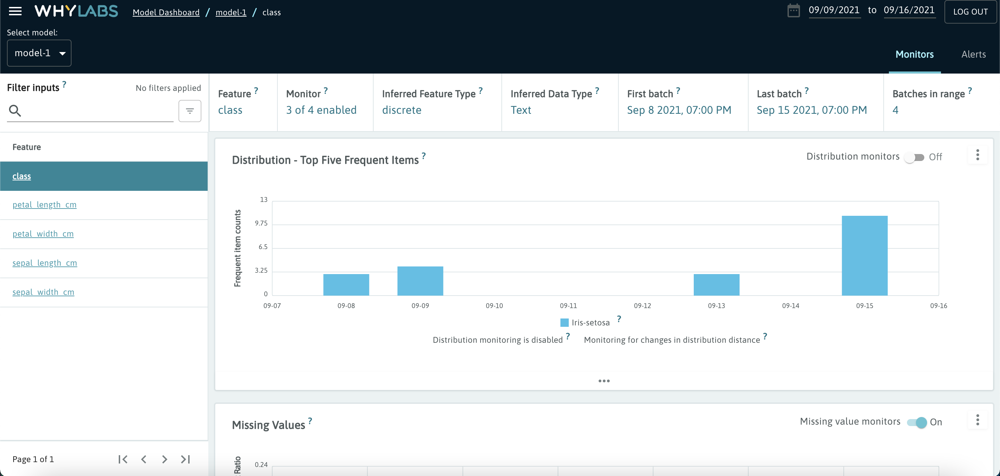

# Amazon SageMaker + WhyLabs integration
SageMaker custom container with scikit-learn inference example that integrates whylabs logging.

## Requirements

- Docker
- An AWS account and AWS CLI installed
- Python 3
- Conda (or any dependency and environment management for Python. e.g. venv.)
- An AWS user that have permissions for SageMakerFullAccess and ECR push access.

## API Structure
This follows a similar structure for the __flask_whylabs_example__ that you can find in the same directory where this is example is.

## 1. Create a conda environment
If you have conda installed, use the included environment.yml file to create a conda environment with these requirements using the following command:

```bash
conda env create -f environment.yml
conda activate whylabs-sagemaker
```

Otherwise, to be able to download the dataset, train the model, deploy the SageMaker endpoint and test it from your computer, the following dependencies are required:

```bash
boto3==1.18.39 # to interact with AWS using python
python-dotenv==0.19.0 # to load .env file
requests==2.26.0
scikit-learn==0.24.2 # to tran the model
pandas==1.3.2 # to manipulate data
jupyterlab==3.1.12
```

## 2. Download data and train the model
To download the data and train the model:

```bash
cd code
python train.py
```

As a result, you will get a __model.joblib__ that will be package within the docker image.

## 3. Configure .env file
Create a .env file inside the __code__ directory. A .env.example file is included as a template, you can adapt it according to your requirements. This .env file will be ignored by docker build but loaded in the next step as a dictionary of environment variables to the container that will be running on SageMaker host.

Inside the .env file you can find important variables used by whylogs for configuration:

- `WHYLABS_CONFIG`: Whylabs yaml file name.
- `WHYLABS_API_KEY`: Whylabs API key/Access token for your organization.
- `WHYLABS_DEFAULT_ORG_ID`: Whylabs organization ID.
- `WHYLABS_DEFAULT_DATASET_ID`: Dataset ID.
- `WHYLABS_API_ENDPOINT`: WhyLabs API endpoint URI.

## 4. Build docker image an push it to AWS ECR
SageMaker uses docker images to run your algorithm. In order to pass an image to SageMaker, you need to build it and push it to Amazon Elastic Container Registry (ECR). The following script will create and ECR repository, login to it, build your image, retag it accordingly and push it to the repository.

```bash
chmod +x build_push.sh
./build_push.sh
```

__Note:__ By default the script uses __defeault__ profile name. If you want to change the name you can find the aws profile names inside ~/.aws folder.

## 5. Deploy endpoint to SageMaker
You should modify the variables values according to configuration made in the last step:

- profile
- image_name
- endpoint_name
- instance_type (in case you want to use another type of instance.)

```bash
python create_endpoint.py   
```
Optional parameters:

- -p `<your-aws-profile-name>`
- -i `<sagemaker-instance-type>`
- -e `<endpoint-name>`

## 6. Test endpoint
Once your endpoint has been created, to test it run the following script.

```bash
python test_endpoint.py
```

Optional parameters:

- -p `<your-aws-profile-name>`
- -i `<sagemaker-instance-type>`
- -e `<endpoint-name>`

The response should look like this:

```bash
{'data': {'class': 'Iris-setosa'}, 'message': 'Success'}
```

## 7. Watch your logs on WhyLabs platform

- Go to https://hub.whylabsapp.com/models


- Select your model (by default is model-1)


- Select the feature of interest and explore



## 8. Clean up AWS created resources
Be careful with keeping your endpoint running because this might generate AWS charges. To clean up your endpoint, you can go to the console and delete it manually or execute the following script which deletes your Sagemaker model, endpoint config and endpoint:

```bash
python clean_up.py
```

Optional parameters:

- -p `<your-aws-profile-name>`
- -e `<endpoint-name>`

## TL;DR

Create a conda environment using the [environment.yml](environment.yml) file and activate it then run [the example notebook](sagemaker_whylabs.ipynb) while inside of this folder.